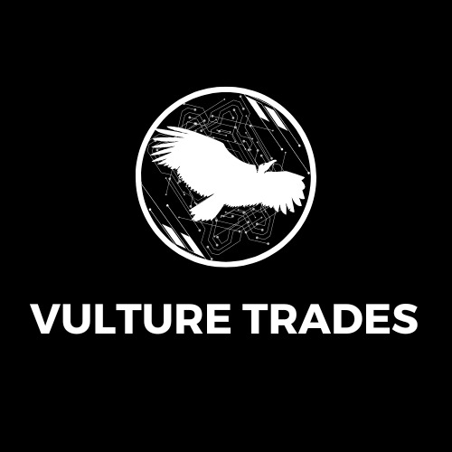

# Projeto Linguagem Programação - P2-B

Projeto sobre a Corretora de Criptomoedas **Vulture Trades** feito em *Java* para a cadeira de **Linguagem de Programação I**.

### Autores: 

- Danilo Pereira: @d4nkali;
- João Gabriel: @JoaoMagalhaes-hub;
- João Vitor: @JANzxz;
- Saulo Pinto: @Olausz.

### Entregas:

#

# Vulture Trades - A carniça da *blockchain*.

  

A **Vulture Trades** nasceu da necessidade de oferecer uma plataforma de corretora de cripto moedas que atenda às demandas e expectativas dos mineradores mais experientes e que utilizem poucos recursos gráficos. Nossa abordagem se baseia na simplicidade, eficiência e transparência através do terminal dedicado do seu *SO*.
